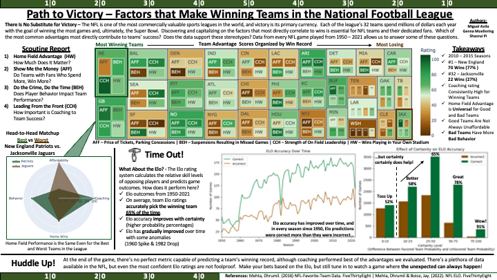

## NFL Exploring and Visualizing Data Project - README File

This group project was the culminating assignment for an Exploring and Visualizing Data Course. It explored and analyzed NFL Data from 1950 to 2022. 

### Path to Victory – Factors that Make Winning Teams in the National Football League

### Group Members:  Genna Moellering, Miguel Avila, Shaorui Pi

This project analyzes the factors that make a team win, comparing Home Field Advantage, Affordability, Player's Behavior, and Coaching Leadership to the actual number of wins each team had throughout the seasons.  

It also compares the accuracy of ELO ratings through time, as well as the accuracy difference between different certainty levels.

Each of these questions is answered in a separate Jupyter Notebook, since we needed to analyze different time periods:
- Question 1: 2010-2015
- Question 2: 1950-2022 

### Question 1

In this question we are analyzing the factors that affect the teams' success. To fully answer this question, we explored the 'Elo' dataset and the 'NFL Favorite Teams' dataset. Combining these two data sets allows us to use the 'NFL Favorite Teams' unique ratings for each team across a broad array of categories, and compare those ratings against the teams' winning rate. The following is a summary of the contents of this Jupyter Notebook:

##### Data Sources

- NFL_ELO: contains game-by-game ELO rating and forecasts for each match from 1920 up to 2022 :
(https://github.com/fivethirtyeight/data/tree/master/nfl-elo)
- NFL Favorite Team: contains grades in 16 different categories for each NFL team, where 100 is the highest and 0 is the lowest (https://github.com/fivethirtyeight/data/blob/master/nfl-favorite-team/)

***Note:*** *the CSV files are read directly from  GitHub; however, we have provided our uncleaned and cleaned datasets within the final delivery zip file*

#####  Data Cleaning

- Since the NFL Favorite Team dataset is from 2016, we decided to keep only the games for the 5 years before (2010 - 2015)
- We deleted columns from Team Picking Categories to keep only the categories we were interested in measuring: Coaching, Affordability, Bang_for_Buck, and Behavior 

##### Visualizations

- Pairplot showing correlations between different category ratings
- Category plots showing how the number of wins changed for each category rating.
- Tree map graph comparing winning rates and category ratings for each of the 32 teams.
- Radar chart comparing the most winning team (New England) against the most losing team (Jacksonville)

### Question 2

For this question, our team is evaluating the accuracy of the NFL's Elo rating system, which is designed to assess teams' relative skill level and predict game outcomes based on previous wins and losses. The following is a summary of the contents of this Jupyter Notebook:

##### Data Sources

- NFL_ELO: contains game-by-game ELO rating and forecasts for each match from 1920 up to 2022 :
(https://github.com/fivethirtyeight/data/tree/master/nfl-elo)

***Note:*** *the CSV file is read directly from  GitHub; however, we have provided our uncleaned and cleaned dataset within the final delivery zip file*

#####  Data Cleaning

- Although we used this same dataset in Question 1, Question 2 required that we use much more of the dataset, which is why we cleaned it in a separate Jupyter Notebook. 
- We used the 'parse_dates' function when reading in the file to change our 'date' datatype to datetime64. 
- We then dropped 17 columns that were either irrelevant to our question or largely contained missing data. 
- We dropped all rows that did not meet a threshold of 16 non-null values, which eliminated all data before 1950, which is when the dataset begins trakcing quarterback Elo ratings. 
- From there, we added some columns, including some that were categorical, which we needed to perform the type of analysis we needed to answer the question.

##### Visualizations

- Catplot the shows how the Elo rating's certainty level (the degree to which the probability rating favored a given team) compares to the Elo's success score.
- Countplot that shows how often the Elo rating was correct in picking the winning team and is grouped by ranges of certainty levels.  
- Line plot comparing ELO accuracy through the seasons 

### References

**Datasets:**

Mehta, Dhrumil. (2016) NFL-Favorite-Team Data. FiveThirtyEight. Retrieved from: https://github.com/fivethirtyeight/data/tree/master/nfl-favorite-team

Mehta, Dhrumil & Boice, Jay. (2022). NFL ELO. FiveThirtyEight. Retrieved from: https://github.com/fivethirtyeight/data/tree/master/nfl-elo

**Consulted sources:**
- Lecture 3 - Data Wrangling I Slides
- Lecture 4 - Data Wrangling II Slides
- Lecture 6 - Categorical Data Slides
- Python Data Science Handbook - 3.08 and 3.09
- https://colorbrewer2.org/#type=sequential&scheme=Greens&n=3
- https://datagy.io/pandas-groupby/
- https://datascience.stackexchange.com/questions/90355/how-can-i-get-rid-of-the-white-space-in-matplotlib
- https://www.data-to-viz.com/#treemap
- https://www.dataquest.io/blog/tutorial-add-column-pandas-dataframe-based-on-if-else-condition/
- https://medium.com/@morganjonesartist/color-guide-to-seaborn-palettes-da849406d44f
- https://medium.com/purple-theory/what-is-elo-rating-c4eb7a9061e0
- https://pandas.pydata.org/pandas-docs/stable/user_guide/groupby.html
- https://pandas.pydata.org/pandas-docs/stable/reference/api/pandas.DataFrame.unstack.html
- https://pbpython.com/groupby-agg.html
- https://plotly.com/python/treemaps/
- https://plotly.com/python/radar-chart/
- https://stackoverflow.com/questions/18172851/deleting-dataframe-row-in-pandas-based-on-column-value
- https://stackoverflow.com/questions/31460146/plotting-value-counts-in-seaborn-barplot
- https://stackoverflow.com/questions/68616781/customizing-the-hue-colors-used-in-seaborn-barplot
- https://stackoverflow.com/questions/33149428/modify-the-legend-of-pandas-bar-plot
- https://towardsdatascience.com/wide-to-long-data-how-and-when-to-use-pandas-melt-stack-and-wide-to-long-7c1e0f462a98
- https://towardsdatascience.com/ultimate-pandas-guide-mastering-the-groupby-104306251739

